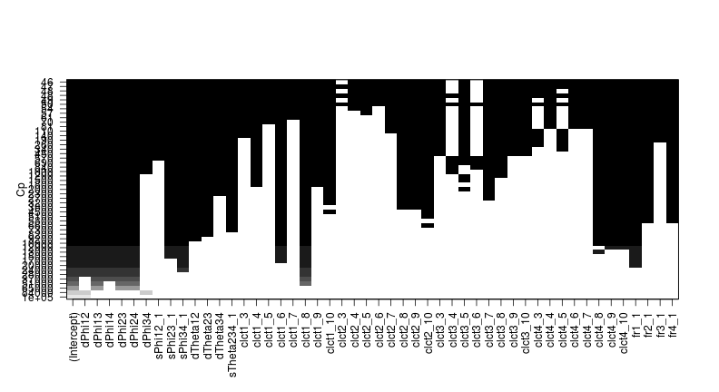
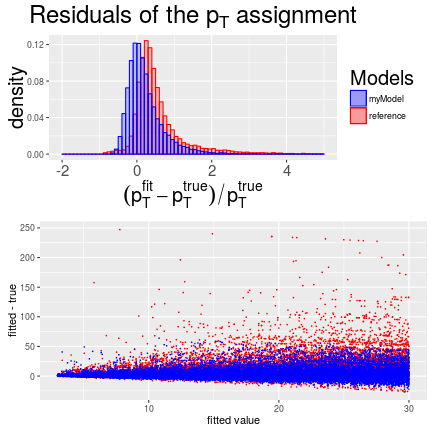

## Outline

1. Input data
  - generation steps
  - regressors and response

2. Model selection
  - standard in-sample metrics for models comparison
  - linear model ("all models are wrong, but some are useful") 

3. Trees
  - boosting (BDT), bagging (Random Forest)
  - predictors' importance
  - residuals and turn-on curves
  - ROCs and efficiency vs. rate curves

--- .class #id

## Training data

* [Generated](https://github.com/kkotov/emtfPtRegression/blob/master/mc.txt) 300$k$ di-muons uniformly in $0.9 < |\eta| < 2.4$ and $0 < p_T < 100~GeV$
* Re-emulated EMTF with Jia Fu's new code [1](https://github.com/jiafulow/DataFormatsSep2016),[2](https://github.com/jiafulow/L1TriggerSep2016) (default switches)
* Produced csv file with my [ntuplizer](https://github.com/kkotov/framework)

The 20 predictors (no input from RPC system yet):

     type        |    trait    |  measurements with 4 stations |   allowed values
-----------------|-------------|-------------------------------|----------------------
 $\Delta\phi$    | continuous  | 1-2, 1-3, 1-4, 2-3, 2-4, 3-4  |    [-512 - +512]
 $\Delta\theta$  | continuous  | 1-2, 1-3, 1-4, 2-3, 2-4, 3-4  |     [-7  -  +7]
 CLCT_Pattern    | categorical |          1, 2, 3, 4           | [2,3,4,5,6,7,8,9,10]
 FrontRear       | categorical |          1, 2, 3, 4           |        [0,1]

<br>

Response variable: $1/p_T$ to rank up accuracy of low $p_T$ regression

--- .class #id

## Simplest performance metrics

* Residual sum of squares ($RSS$) and Root Mean Squared Error ($RMSE$):

\[ RSS = \Sigma^N_{i=0} (y_i - \hat{y}_i)^2, RMSE = \sqrt{\frac{1}{N}\Sigma^N_{i=0}(y_i - \hat{y}_i)^2} \]

* Fraction of variance explained ($R^2$):
  \[ R^2 = 1 - \frac{RSS}{TSS}, TSS = \Sigma^N_{i=0} (y_i - \bar{y}_i)^2 \]
  * 0 - no better than the baseline $\hat{y} = \bar{y}$ model, 1 - ideal model
  * for simple linear regression $y \sim x$, $R$ is just a correlation between $x$ and $y$

The more predictors (freedoms) one uses to build a model the better it fits training data

Metrics above will always favor more complex models fitting in-sample noise


--- .class #id

## In-sample performance and model complexity

* $F$-statistics (lack-of-fit sum-of-squares over pure error sum-of-squares): 
$$ F = \frac{(RSS_0-RSS_1)/(p_1-p_0)}{RSS_1/(N-p_1-1)} \sim F_{p_1-p_0,N-p_1-1} \rightarrow \chi^2_{p_1-p_0}/(p_1-p_0) $$
  + tests if model with $p_1$ parameters is better than nested model with $p_0$ parameters
  + $z$-score of a coefficient is equivalent to $F$-statistics for dropping this coefficient out
  + unlike the $z$-score, $F$-statistics can also handle categorical predictors

* Adjusted $R^2$ (regular $R^2$ penalized for model complexity): 

\[ Adjusted~R^2 = 1 - \frac{RSS/(N-p-1)}{TSS/(N-1)} \]

* Mallow's $C_p = \frac{1}{N}(RSS + 2d\hat{\sigma}_{\epsilon(y)}^2)$, ($d < p$ - number of predictors used)
  + second term (form for linear model) compensates against in-sample overfitting
  + $C_p$ is commonly used for best subset and stepwise model selections

--- .class #id

## Ranking predictors for linear model


```
Analysis of Variance Table

Model 1: 1/pt ~ abs(dPhi12)
Model 2: 1/pt ~ abs(dPhi12) + abs(dPhi23)
Model 3: 1/pt ~ abs(dPhi12) + abs(dPhi23) + abs(dPhi34)
Model 4: 1/pt ~ abs(dPhi12) + abs(dPhi23) + abs(dPhi34) + abs(dPhi13)
Model 5: 1/pt ~ abs(dPhi12) + abs(dPhi23) + abs(dPhi34) + abs(dPhi13) + abs(dPhi14)
Model 6: 1/pt ~ abs(dPhi12) + abs(dPhi23) + abs(dPhi34) + abs(dPhi13) + abs(dPhi14) + abs(dPhi24)
  Res.Df    RSS Df Sum of Sq         F    Pr(>F)    
1 311344 169.88                                     
2 311343 169.87  1    0.0107    23.072 1.562e-06 ***
3 311342 161.19  1    8.6854 18758.408 < 2.2e-16 ***
4 311341 156.31  1    4.8794 10538.338 < 2.2e-16 ***
5 311340 156.21  1    0.0960   207.349 < 2.2e-16 ***
6 311339 144.16  1   12.0570 26040.235 < 2.2e-16 ***
---
Signif. codes:  0 '***' 0.001 '**' 0.01 '*' 0.05 '.' 0.1 ' ' 1
```

--- &twocol

## Visualizing some of the linear fits

Linear fit does not do well for dPhi23 (also seen as low $F$-statistics above):

*** =left


```r
plot(abs(v$dPhi12), 1/v$pt, cex=.1)
abline(lm(1/pt~abs(dPhi12),v),col="red")
```


*** =right


```r
plot(abs(v$dPhi23), 1/v$pt, cex=.1)
abline(lm(1/pt~abs(dPhi23),v),col="red")
```


*** =fullwidth

--- .class #id

## Ranking predictors with lasso

Lasso calculates model parameters $\beta$ by minimizing regularized loss $RSS + \lambda\Sigma_{i=1}^p|\beta_i|$


```r
x = model.matrix(1/pt ~ abs(dPhi12) + abs(dPhi23) + abs(dPhi34) - 1, v)
plot( glmnet(x, 1/d$pt), xvar="lambda", label=T )
```


dPhi12 (#1) is the last suppressed with growing $\lambda$, while dPhi23 (#2) is sacrificed first

--- .class #id

## Choosing best predictors in linear model

Best subset selection "switches on" (shades of gray) predictors as follows:


The most important predictors in a linear model (of my choice) are dPhi, clct1 and fr1

--- .class #id

## Tree-based methods

Simple decision tree: just crude partitioning of the predictor space

Boosting (in BDT):
  - iteratively fit $(x,r)$, where residuals $r_0 = y$ and $r_k = r_{k-1} - \lambda\hat{f}_{k-1}(x)$
  - output of the boosted model with complex decision boundary: $\hat{f}(x) = \Sigma_{k=1}^K\lambda \hat{f}_k(x)$

Bagging or Bootstrap aggregation (in Random Forest or RF used through the rest of this study):
  - resample input data multiple times leaving a part of randomly chosen events out 
  - each time fit a collection of small $mtry$-sized trees of randomly chosen predictors
  - average these (largely *de-correlated*) noisy but unbiased models to reduce variance 
  - along the way construct out-of-bag (OOB) error estimate with the left out data

Cross-validation (repetitive testing of a model on data never seen before) is part of RF training

--- .class #id

## Selecting best predictors for trees

Absolute predictor's importance = difference in predictive measure (e.g. MSE) with the original
training dataset and a dataset with this predictor being randomly 'permuted':


dPhi predictors are the winners (with the first station been most important) followed by clct1

--- .class #id

## Input compression

I need to fit the model above into our 2Gb Look Up Table addressed with just 30 bits

Required transformations: 
  * use mode [compression](https://github.com/kkotov/emtfPtRegression/blob/master/modeCoding.txt): "heaviest" 4-station measurement is indexed with one bit
  * make all predictors unsigned; "saturate" them to max value when they are too big
  * assign a bit per relevant relative sign (e.g. sign($\Delta\phi_{2-3}*\Delta\phi_{1-2}$) $\equiv$ S($\Delta\phi_{2-3/1-2}$))
  * strip non-informative CLCT levels (linear model suggest clct=6,8,10 most important ones)

Following (potentially sub-optimal) scheme, inspired by [current code](https://github.com/jiafulow/L1TriggerSep2016/blob/master/L1TMuonEndCap/src/EMTFPtAssignmentEngine.cc#L305-L325), is used in next slides:

  $\Delta\phi_{1-2}$ | $\Delta\phi_{1-3}$ | $\Delta\phi_{1-4}$ | $\Delta\phi_{2-3}$ | $\Delta\phi_{2-4}$ | $\Delta\phi_{3-4}$ | S($\Delta\phi_{2-3/1-2}$) | S($\Delta\phi_{3-4/1-2}$) | $\Delta\theta_{1-2}$ | clct1 
---------------------|--------------------|--------------------|--------------------|--------------------|--------------------|-------------------------------------------|---------------------------------------------|----------------------|-------
          [6:0]      |         --         |         --         |        [6:0]       |         --         |        [6:0]       |                    [0]                    |                   [0]                       |          [1:0]       | [1:0]

--- &twocol

## Residuals


*** =left


```
[1] "Standard diviation for the reference:  0.0384502209678907"
[1] "Standard diviation for my model:  0.0416256175683441"
```


*** =right


```
[1] "Standard diviation for the reference:  17.9980400950663"
[1] "Standard diviation for my model:  9.2854886658628"
```



*** =fullwidth

--- .class #id

## Other performance metrics: turn-on curves

<br>


--- .class #id

## Summary

Ranking predictors by their importance is an easy job, fitting them in 30 bits is difficult

--- .class #id

<br><br><br>

\[ \Large Backup \]

--- .class #id

## 2-3-4 station tracks (mode_inv=14)

 $\Delta\phi_{2-3}$ | $\Delta\phi_{2-4}$ | $\Delta\phi_{3-4}$ | clct2 | clct3 | clct4
--------------------|--------------------|--------------------|-------|-------|-------
        [6:0]       |         --         |        [6:0]       | [1:0] | [1:0] | [1:0]

<br>


--- .class #id

## CLCT Patterns


