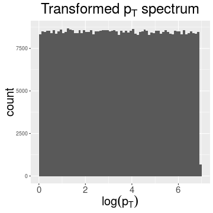
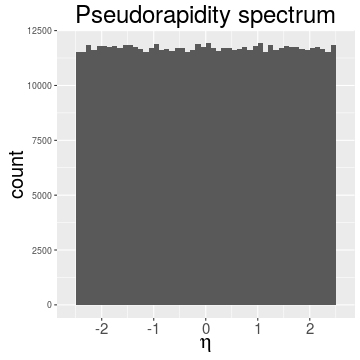
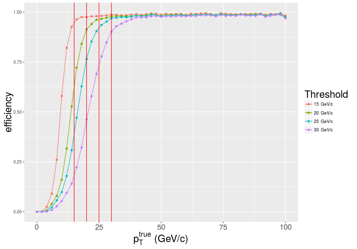
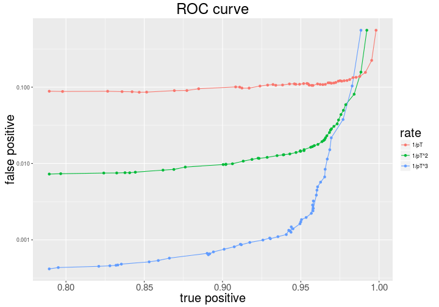
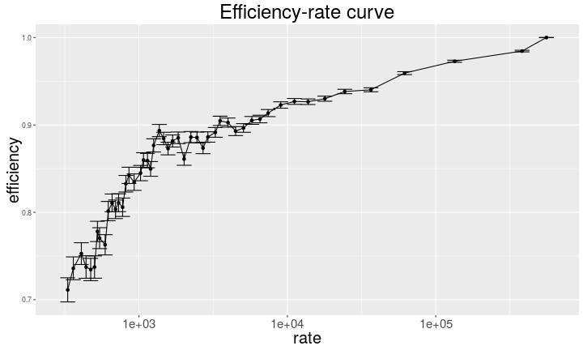
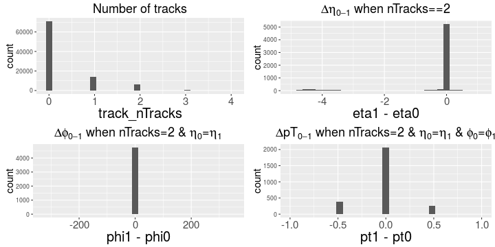
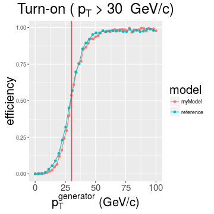
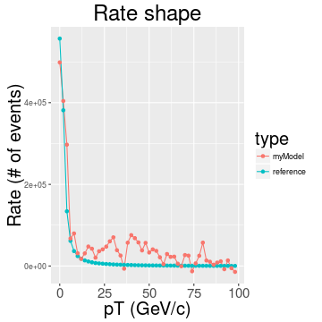
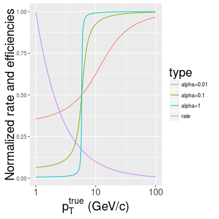
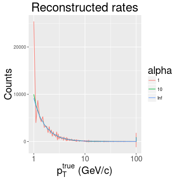

## Outline

1. New input data
  - numbers and shapes

2. Metrics
  - turn-ons
  - ROC curves and importance of true rate assumption
  - rate-efficiency plots

3. Assessing the true rate
  - matrix method
  - input data
  - example with the model built using all predictors
  - instability of the method
  - solution: rate parametrization

--- &twocol

## New Monte Carlo simulation data 

* Andrew's <span style="font-weight:bold;color:brown">/store/user/abrinke1/EMTF/MC/SingleMu_Pt1To1000_FlatRandomOneOverPt</span>
  - a double muon sample, flat in $0 < |\eta| < 2.5$ (barrel included)
  - about 300$k$ muons in endcaps extending to $p_T = 1000~GeV$, flat in $log(p_T)$


*** =left



*** =right



*** =fullwidth

--- .class #id

## Turn-on curve

Turn-on is nothing else but a decision boundary, smeared due to a finite resolution

It is a proportion of events surpassing a given decision threshold in every bin of true pT

 

--- .class #id

## Examples of turn-ons

For the current system the turn-ons for several thresholds look as follows:





--- .class #id

## ROC curve

Convolute turn-on (efficiency) with rate and see % of under-the-threshold (false positives)
and % of over-the-threshold (true positives) rate accepted for a given threshold

To construct the ROC scan over the threshold and plot false positive vs. true positive rates 

 

--- .class #id

## ROC curves for different rates

Rate assumption has a dramatic effect on how the same performance looks in our system:




--- .class #id

## True rate assessment

The true rate can be measured right from the data with the current system

The measured rate is a convolution of the unknown true rate and known turn-on:

$$
\left\{\begin{array}{lll}
R_1 e^1_1 + R_2 e^1_2 + ... + R_N e^1_N = r_1 \\
... \\
R_1 e^M_1 + R_2 e^M_2 + ... + R_N e^M_N = r_M \\
\end{array}
\right., \text{where}
$$

* $R_i$ - true rate in bins of true pT
* $e^j_i$ - turn-on efficiency in $i^{th}$ bin of true pT for threshold $j$
* $r_j$ - measured rate above threshold $j$

The solution in matrix form looks as follows: $R = e^{-1} r$

For a step-like turn-on $e$ is an integrator and $e^{-1}$ is a differentiator

Unfortunately, inverting the real turn-on matrix turned out to give a highly unstable $R$

--- .class #id

## Exchanging true rate for measured

There may by no high pT muons in MinBias sample $\rightarrow$ tail is made of promoted muons

Measured rate is more relevant performance parameter than % of false positives

Efficiency right above threshold is a good estimate of % of true positives for vanishing spectra:
 

--- .class #id

## Efficiency-rate metric




New model's rate can be projected using current rate and turn-ons: $r' = e' R = (e' e^{-1}) r$

--- .class #id

## Input data for rate assessment

Use ntuples in <span style="font-weight:bold;color:brown">/store/user/abrinke1/EMTF/Emulator/ntuples/ZeroBiasIsolatedBunch0</span>

With no codebook or a reference to the ntuplizer I cannot make sense of the plots:




Why there are so many events with two seemingly identical tracks? I'll consider 1$^{st}$ track only.

--- &twocol

## Building model with all predictors


*** =left


```
Warning: Removed 15 rows containing missing values (geom_path).
```

```
Warning: Removed 15 rows containing missing values (geom_point).
```



*** =right



*** =fullwidth

New model does better (left plot), but the rate derived from matrix inversion is unstable

--- &twocol

## Source of the instability 

Let's take an ideal $1/p_T^2$ rate shape and $atan(\alpha(p_T^{true}-p_T^{thresh}+\delta))$ for smooth turn-on

Reconstructing true rate for different turn-on widths I see $det(turnOn)$ vanishes

*** =left




*** =right



*** =fullwidth

Linear system becomes digenerate when threshold's step approaches the turn-on width

--- .class #id

## Parametrizing the rate shape

The above problem can be avoided if the rate shape is parameterized with just few handles

Now I am trying our different smooth shapes and numerical minimization of -log likelihood

To be continued ...

