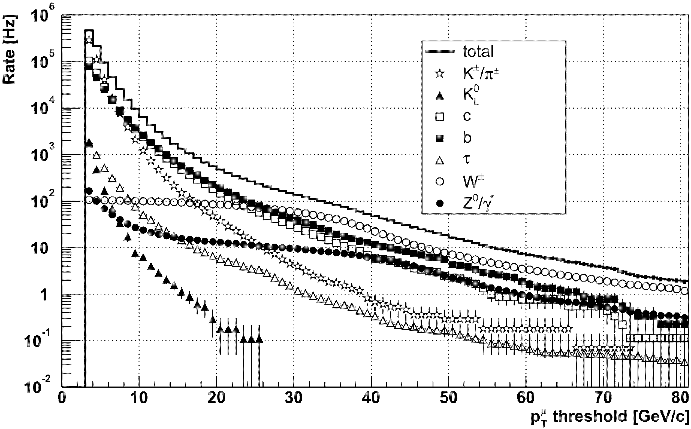

## Outline

1. New input data
  - numbers and shapes

2. ROC metric
  - rate against efficiency
  - examples with various rate assumptions

3. Model building
  - using all predictors

--- &twocol

## New Monte Carlo simulation data 

* Andrew's <span style="font-weight:bold;color:brown">/store/user/abrinke1/EMTF/MC/SingleMu_Pt1To1000_FlatRandomOneOverPt</span>
  - a double muon sample, flat in $0 < |\eta| < 2.5$ (barrel included)
  - about 300$k$ muons in endcaps extending to $p_T = 1000~GeV$, flat in $log(p_T)$

```{r message = F, echo = F}
mode_inv <- 15
mode = c(0, 0, 12, 0, 10, 5, 14, 0, 9, 5, 13, 3, 11, 7, 15)
df <- read.csv(file="../../pt/SingleMu_Pt1To1000_FlatRandomOneOverPt.csv",header=T,sep=',')

d1 <- df[df[,"mode.0."]==mode[mode_inv], c( grep("\\.[0-1]\\.",colnames(df),invert=T) , grep(".0.",colnames(df),fixed=T) ) ]
d2 <- df[df[,"mode.1."]==mode[mode_inv], c( grep("\\.[0-1]\\.",colnames(df),invert=T) , grep(".1.",colnames(df),fixed=T) ) ]

colnames(d1) <- sub(".0.", "", colnames(d1),fixed=T)
colnames(d2) <- sub(".1.", "", colnames(d2),fixed=T)

d <- rbind(d1,d2)

require(ggplot2)
```

*** =left

```{r, fig.height=5., fig.width=5., fig.align = 'center', comment = NA, message = F, echo = F}
ggplot(df, aes(x=log(muPtGen) )) +
    geom_histogram(breaks=seq(0,7,0.1)) +
    theme(
        title = element_text(size=20),
        axis.title.x = element_text(size=20),
        axis.text.x  = element_text(size=15)
    ) +
    labs( x=expression(log(p[T])),
          y="count",
          title=expression(paste("Transformed ", p[T], " spectrum"))
    )
```

*** =right

```{r, fig.height=5., fig.width=5., fig.align = 'center', comment = NA, message = F, echo = F}
ggplot(df, aes(x=muEtaGen)) +
    geom_histogram(breaks=seq(-2.6,2.6,0.1)) +
    theme(
        title = element_text(size=20),
        axis.title.x = element_text(size=20),
        axis.text.x  = element_text(size=15)
    ) +
    labs( x=expression(eta),
          y="count",
          title="Pseudorapidity spectrum"
    )
```

*** =fullwidth

--- .class #id

## Turn-on curve

Turn-on is nothing else but a decision boundary, smeared due to a finite resolution

It is a proportion of events surpassing a given decision threshold in every bin of true pT

 

--- .class #id

## Examples of turn-ons

For the current system the turn-ons for several thresholds look as follows:

```{r, comment = NA, message = F, echo = F}

source("../metrics.R")

binning = seq(0,100,2)

slimDF <- with(d, data.frame(true_pT = muPtGen, response_pT = pt) )
slimDF$trueBin <- sapply(slimDF$true_pT, findBin, binning)

pSpec <- aggregate(slimDF, by=list(bin=slimDF$trueBin), function(x) x )
norms <- sapply(pSpec$response_pT,length)

counts  <- t(sapply(pSpec$response_pT,function(x) sapply(binning,function(y) sum(unlist(x)>y) )))

# now, plot some of the turn-ons for completeness
benchmarkThrs     <- c(15, 20, 25, 30)
benchmarkThrBins <- sapply(benchmarkThrs, findBin, binning)

turnOnDF <- data.frame( eff = as.vector(counts[,benchmarkThrBins] / norms),
                        threshold_pT = factor(as.vector(sapply(benchmarkThrs, rep, length(binning)))),
                        true_pT = rep(binning, length(benchmarkThrs))
                      )

turnOnDF$se <- with(turnOnDF,sqrt(eff*(1-eff)/rep(norms,length(benchmarkThrs))))

turnOnPlot <- ggplot(turnOnDF, aes(x=true_pT, y=eff, group=threshold_pT, colour=threshold_pT)) +
        geom_errorbar(aes(ymin=eff-se, ymax=eff+se), width=.1) +
        geom_line() +
        geom_point() +
        geom_vline(xintercept = benchmarkThrs, colour = "red") +
        theme(
            title = element_text(size=20),
            axis.title.x = element_text(size=20),
            axis.text.x  = element_text(size=15)
        ) +
        labs( x=expression(paste(p[T] ^{true}," (GeV/c)")),
              y="efficiency") +
        scale_colour_discrete("Threshold",
                              labels = paste(benchmarkThrs," GeV/c"))

```

```{r, fig.height=7., fig.width=10., fig.align = 'center', comment = NA, message = F, echo = F}
turnOnPlot
```


--- .class #id

## ROC curve

Convolute turn-on (efficiency) with rate and see % of under-the-threshold (false positives)
and % of over-the-threshold (true positives) rate accepted for a given threshold

To construct the ROC scan over the threshold and plot false positive vs. true positive rates 

 

--- .class #id

## ROC curves for different rate shapes

Rate assumption has a dramatic effect on how the same performance looks in our system:

```{r, comment = NA, message = F, echo = F}

source("../metrics.R")

true_pT <- seq(1.5,1000.5,1)
trigRate1 <- 1/true_pT   * 1000 
trigRate2 <- 1/true_pT^2 * 1000 
trigRate3 <- 1/true_pT^3 * 1000 

rateShape <- data.frame( true_pT = rep(true_pT,3),
                         type = factor(c(rep(1,length(trigRate1)),
                                         rep(2,length(trigRate2)),
                                         rep(3,length(trigRate3)))),
                         trigRate = c(trigRate1,trigRate2,trigRate3)
                       )

rateShapeBinned <- as.matrix( by(rateShape$trigRate, list(rateShape$type,sapply(rateShape$true_pT, findBin, binning)), sum) )

nBins <- length(binning)
normForTruePos  <- sapply(1: nBins,   function(x) rowSums( cbind(rateShapeBinned[,x:nBins], rep(0,3)) ) )
normForFalsePos <- sapply(0:(nBins-1),function(x) rowSums( cbind(rateShapeBinned[,0:x],     rep(0,3)) ) )

turnOn <- counts/norms

truePos  <- sapply(1: nBins,   function(x) drop(cbind(rateShapeBinned[,x:nBins],rep(0,3)) %*% c(turnOn[x:nBins,x],0)))
falsePos <- sapply(0:(nBins-1),function(x) if(x==0) rep(0,3) else drop(cbind(rateShapeBinned[,1:x],rep(0,3)) %*% c(turnOn[1:x,x+1],0)))

rocDF <- data.frame(
                    truePos  = as.vector(t(truePos/normForTruePos)[2:nBins,]),
                    falsePos = as.vector(t(falsePos/normForFalsePos)[2:nBins,]),
                    rate     = factor(c(rep("1/pT",nBins-1),rep("1/pT^2",nBins-1),rep("1/pT^3",nBins-1)))
                   )

rocPlot <- ggplot(rocDF, aes(x=truePos, y=falsePos, group=rate, colour=rate)) +
#        geom_errorbar(aes(ymin=eff-se, ymax=eff+se), width=.1) +
        geom_line() +
        geom_point() +
        theme(
            title = element_text(size=20),
            axis.title.x = element_text(size=20),
            axis.text.x  = element_text(size=15)
        ) +
        labs( x="true positive",
              y="false positive",
              title="ROC curve"
        ) + scale_y_log10()
```

```{r, fig.height=7., fig.width=10., fig.align = 'center', comment = NA, message = F, echo = F}
rocPlot
```

--- .class #id

## True rate assesement

The true rate can be measured right from the data with the current system

The measured rate is a convolution of the unknown true rate and known turn-on:

$$
\left\{\begin{array}{lll}
R_1 e^1_1 + R_2 e^1_2 + ... + R_N e^1_N = r_1 \\
... \\
R_1 e^M_1 + R_2 e^M_2 + ... + R_N e^M_N = r_M \\
\end{array}
\right., \text{where}
$$

* $R_i$ - true rate in bins of true pT
* $e^j_i$ - turn-on efficiency in $i^{th}$ bin of true pT for threshold $j$
* $r_j$ - measured rate above threshold $j$

The solution in matrix form looks as follows: $R = e^{-1} r$

For a step-like turn-on $e$ is an integrator and $e^{-1}$ is a differentiator

Unfortunately, inverting the real turn-on matrix turned out to give a highly unstable $R$

--- .class #id

## Exchanging true rate for measured

There may by no high pT muons in MinBias sample $\rightarrow$ tail is made of promoted muons

Measured rate is more relevant performance parameter than % of false positives

Efficiency right above threshold is a good estimate of % of true positives for vanishing spectra:
 

--- .class #id

## Efficiency-rate metric

```{r, comment = NA, message = F, echo = F}
## running this bash snippet on Andrew's ntuples:
# i=27; while [ $i -gt 0 ] ; do echo $i;  cat dump.R | sed -e "s|PART|$i|g" > d$i"".R ; R CMD BATCH d$i.R ; rm -f .RData d$i.R d$i.Rout ; i=`expr $i - 1`; done
#
## where dump.R looks as follows:
# binning = seq(0,100,2)
# mb <- read.csv(file="tuple_PART.csv",header=T,sep=',')
# rPART <- sapply(binning, function(x) sum( with( subset(mb,track_nTracks>0), track_pt.0. ) > x ) )
# save(file="rPART.RData",rPART)
#
## and then combining the pieces with:
 files <- paste("r",seq(6,27,1),".RData",sep='')
 for(f in files[c(1,2,3,7,8,9,10,12,13,14,15,16,17,18,19,20,21,22)]) load(f)
 r <- r6 + r7 + r8 + r12 + r13 + r14 + r15 + r17 + r18 + r19 + r20 + r21 + r22 + r23 + r24 + r25 + r26 + r27
#
## closure test - for the infinitely sharp turn-on R = -dr/dpT (up to dpT that we omit here for constant bin widt):
# idealTurnOn <- matrix(rep(0,51*51), ncol=51, nrow=51)
# for(i in 1:51) for(j in i:51) idealTurnOn[i,j] = 1
# solve(idealTurnOn)
#
# coarseThr    <- c(5,10,15,20,25,30)
# coarseCounts <- t(sapply(pSpec$response_pT,function(x) sapply(coarseThr,function(y) sum(unlist(x)>y) )))
# coarseTurnOn <- coarseCounts/norms
# R <- qr.solve(coarseTurnOn[1:nBins-1,1:5],r[1:nBins-1])

#effRate <- ggplot(data.frame(rate=r,

```

```{r, fig.height=5., fig.width=10., fig.align = 'center', comment = NA, message = F, echo = F}
```

Any new model's rate can be projected using current rate and turn-ons: $r' = e' R = (e' e^{-1}) r$

--- .class #id

## Input data for the rate assesement

Use ntuples in <span style="font-weight:bold;color:brown">/store/user/abrinke1/EMTF/Emulator/ntuples/ZeroBiasIsolatedBunch0</span>

With no codebook or a reference to the ntuplizer I cannot make sense of the plots:

```{r, comment = NA, message = F, echo = F}
mb <- read.csv(file="../../pt/tuple_27.csv",header=T,sep=',')

nTrk <- ggplot(mb, aes(x=track_nTracks)) +
        geom_histogram() +
        theme(
            title = element_text(size=15),
            axis.title.x = element_text(size=20),
            axis.text.x  = element_text(size=15)
        ) +
        labs(title="Number of tracks")

slimMB <- with(subset(mb,track_nTracks==2),
               data.frame(ec1=track_endcap.1.,
                          ec0=track_endcap.0.,
                          eta1=track_eta.1.,
                          eta0=track_eta.0.,
                          phi1=track_phi.1.,
                          phi0=track_phi.0.,
                          pt1=track_pt.1.,
                          pt0=track_pt.0.,
                          mode1=track_mode.1.,
                          mode0=track_mode.0.,
                          bx1=track_BX.1.,
                          bx0=track_BX.0.
                         )
               )

dEta <- ggplot(slimMB, aes(x=eta1-eta0) ) +
        geom_histogram() +
        theme(
            title = element_text(size=15),
            axis.title.x = element_text(size=20),
            axis.text.x  = element_text(size=15)
        ) +
        labs(title=expression(paste(Delta, eta[0-1]," when nTracks==2")))

dPhi <- ggplot(subset(slimMB,ec1==ec0 & eta1==eta0), aes(x=phi1-phi0) ) +
        geom_histogram() +
        theme(
            title = element_text(size=15),
            axis.title.x = element_text(size=20),
            axis.text.x  = element_text(size=15)
        ) +
        labs(title=expression(paste(Delta, phi[0-1]," when nTracks=2 & ", eta[0], "=", eta[1])))

dpT  <- ggplot(subset(slimMB,ec1==ec0 & phi1==phi0 & eta1==eta0), aes(x=pt1-pt0) ) + 
        geom_histogram() +
        theme(
            title = element_text(size=15),
            axis.title.x = element_text(size=20),
            axis.text.x  = element_text(size=15)
        ) +
        labs(title=expression(paste(Delta, pT[0-1]," when nTracks=2 & ", eta[0], "=", eta[1], " & ", phi[0], "=", phi[1]))) +
        xlim(-1,1)
```

```{r, fig.height=5., fig.width=10., fig.align = 'center', comment = NA, message = F, echo = F}
require("gridExtra")
suppressWarnings( grid.arrange(nTrk,dEta,dPhi,dpT) )
```

Why there are so many events with two seemingly identical tracks? 

--- &twocol

## Model with all predictors included

```{r, comment = NA, message = F, echo = F}

require(ranger)
vars <- with(d,data.frame( 1/muPtGen,
                           2*atan(exp(-muEtaGen)),
                           pt,
                           mypt,
                           dPhi12,
                           dPhi13,
                           dPhi14,
                           dPhi23,
                           dPhi24,
                           dPhi34,
                           dTheta12,
                           dTheta13,
                           dTheta14,
                           dTheta23,
                           dTheta24,
                           dTheta34,
                           factor(clct1,levels=c(2,3,4,5,6,7,8,9,10)),
                           factor(clct2,levels=c(2,3,4,5,6,7,8,9,10)),
                           factor(clct3,levels=c(2,3,4,5,6,7,8,9,10)),
                           factor(clct4,levels=c(2,3,4,5,6,7,8,9,10)),
                           factor(fr1,levels=c(0,1)),
                           factor(fr2,levels=c(0,1)),
                           factor(fr3,levels=c(0,1)),
                           factor(fr4,levels=c(0,1))
                           )
            )
predictors <- c("dPhi12", "dPhi13", "dPhi14", "dPhi23", "dPhi24", "dPhi34", "dTheta12", "dTheta13", "dTheta14", "dTheta23", "dTheta24", "dTheta34", "clct1", "clct2", "clct3", "clct4", "fr1", "fr2", "fr3", "fr4")
colnames(vars) <- c("muPtGenInv", "theta", "ptTrg", "mypt", predictors )
predictors <- c("theta", predictors)

set.seed(1)

part <- sample(seq(nrow(vars)), as.integer(nrow(vars)*0.75), replace=F)
trainSet <- vars[part,]
testSet <- vars[-part,]
POI <- which(colnames(vars)=="muPtGenInv")

f <- as.formula(paste("muPtGenInv ~ ", paste(predictors, collapse= "+")))

invisible( capture.output( modelFit <- ranger(f, data=trainSet, importance="impurity") ) )
```

*** =left

```{r, fig.height=5., fig.width=5., fig.align = 'center', comment = NA, message = F, echo = F}
source("../turnOn.R")
turnOn(modelFit,shift=14)
```

*** =right

```{r, fig.height=5., fig.width=5., fig.align = 'center', comment = NA, message = F, echo = F}

source("../metrics.R")
metrics(modelFit,testSet)

#barplot( modelFit$variable.importance, horiz=T, col='red', xlab='Delta MSE', las=2 )
```

*** =fullwidth

Before doing forward/backward stepwise selection, I'll truncate the dPhi, dTheta precision

--- &twocol

## Compressing dPhi, dTheta, and theta

Let's leave 5 bits per dPhi, 3 bits per dTheta and theta:

```{r, comment = NA, message = F, echo = F}

sat <- function(x, n){ m <- bitwShiftL(1L,n)-1 ; y <- x ; y[ y>m ] = m ; y[ y < -m ] = -m ; y }

vars <- with(d,data.frame( 1/muPtGen,
                           sat(2*atan(exp(-muEtaGen)),3),
                           pt,
                           mypt,
                           sat(dPhi12,5),
                           as.factor(ifelse(dPhi12>=0,0,1)),
                           as.factor(ifelse(dPhi13*dPhi12>=0,0,1)),
                           as.factor(ifelse(dPhi14*dPhi12>=0,0,1)),
                           sat(dPhi23,5),
                           as.factor(ifelse(dPhi23*dPhi12>=0,0,1)),
                           as.factor(ifelse(dPhi24*dPhi12>=0,0,1)),
                           sat(dPhi34,5),
                           as.factor(ifelse(dPhi34*dPhi12>=0,0,1)),
                           sat(dTheta12,3),
                           as.factor(ifelse(dTheta12>=0,0,1)),
                           as.factor(ifelse(dTheta13*dTheta12>=0,0,1)),
                           as.factor(ifelse(dTheta14*dTheta12>=0,0,1)),
                           sat(dTheta23,3),
                           as.factor(ifelse(dTheta23*dTheta12>=0,0,1)),
                           as.factor(ifelse(dTheta24*dTheta12>=0,0,1)),
                           sat(dTheta34,3),
                           as.factor(ifelse(dTheta34*dTheta12>=0,0,1)),
                           factor(clct1,levels=c(2,3,4,5,6,7,8,9,10)),
                           factor(clct2,levels=c(2,3,4,5,6,7,8,9,10)),
                           factor(clct3,levels=c(2,3,4,5,6,7,8,9,10)),
                           factor(clct4,levels=c(2,3,4,5,6,7,8,9,10)),
                           factor(fr1,levels=c(0,1)),
                           factor(fr2,levels=c(0,1)),
                           factor(fr3,levels=c(0,1)),
                           factor(fr4,levels=c(0,1))
                           )
            )

predictors <- c("dPhi12", "sPhi12", "sPhi1213", "sPhi1214", "dPhi23", "sPhi1223", "sPhi1224", "dPhi34", "sPhi1234", "dTheta12", "sTheta12", "sTheta1213", "sTheta1214", "dTheta23", "sTheta1223", "sTheta1224", "dTheta34", "sTheta1234", "clct1", "clct2", "clct3", "clct4", "fr1", "fr2", "fr3", "fr4")
colnames(vars) <- c("muPtGenInv", "theta", "ptTrg", "mypt", predictors )
predictors <- c("theta", predictors)

derivatives <- data.frame(
    dPhi13 = vars$dPhi12 + ifelse(vars$sPhi1213==1,-1,1) * vars$dPhi23, 
    dPhi14 = vars$dPhi12 + ifelse(vars$sPhi1213==1,-1,1) * vars$dPhi23 + ifelse(vars$sPhi1234==1,-1,1) * vars$dPhi34,
    dPhi24 = vars$dPhi23 + ifelse(as.numeric(as.character(vars$sPhi1223))+as.numeric(as.character(vars$sPhi1224))==1,-1,1) * vars$dPhi34
)

vars <- cbind(vars,derivatives)

set.seed(1)

part <- sample(seq(nrow(vars)), as.integer(nrow(vars)*0.75), replace=F)
trainSet <- vars[part,]
testSet <- vars[-part,]
POI <- which(colnames(vars)=="muPtGenInv")

f <- as.formula(paste("muPtGenInv ~ ", paste(predictors, collapse= "+")))

invisible( capture.output( modelFit2 <- ranger(f, data=trainSet, importance="impurity") ) )

```
*** =left

```{r, fig.height=5., fig.width=5., fig.align = 'center', comment = NA, message = F, echo = F}
turnOn(modelFit2,shift=13)
```

*** =right

```{r, fig.height=5., fig.width=5., fig.align = 'center', comment = NA, message = F, echo = F}
barplot( modelFit2$variable.importance, horiz=T, col='red', xlab='Delta MSE', las=2 )
```

*** =fullwidth

--- .class #id

## dPhi12, dPhi23, dPhi34, theta, clct1, dTheta12

```{r, comment = NA, message = F, echo = F}

sat <- function(x, n){ m <- bitwShiftL(1L,n)-1 ; y <- x ; y[ y>m ] = m ; y[ y < -m ] = -m ; y }

vars <- with(d,data.frame( 1/muPtGen,
                           sat(2*atan(exp(-muEtaGen)),3),
                           sat(dPhi12,5),
                           sat(dPhi23,5),
                           sat(dPhi34,5),
                           as.factor(ifelse(dPhi34*dPhi12>=0,0,1)),
                           sat(dTheta12,3),
                           factor(clct1,levels=c(2,3,4,5,6,7,8,9,10))
                           )
            )

predictors <- c("dPhi12", "dPhi23", "dPhi34", "sPhi1234", "dTheta12", "clct1")
colnames(vars) <- c("muPtGenInv", "theta", predictors )
predictors <- c("theta", predictors)

derivatives <- data.frame(
    dPhi13 = vars$dPhi12 + ifelse(vars$sPhi1213==1,-1,1) * vars$dPhi23, 
    dPhi14 = vars$dPhi12 + ifelse(vars$sPhi1213==1,-1,1) * vars$dPhi23 + ifelse(vars$sPhi1234==1,-1,1) * vars$dPhi34,
    dPhi24 = vars$dPhi23 + ifelse(as.numeric(as.character(vars$sPhi1223))+as.numeric(as.character(vars$sPhi1224))==1,-1,1) * vars$dPhi34
)

vars <- cbind(vars,derivatives)

set.seed(1)

part <- sample(seq(nrow(vars)), as.integer(nrow(vars)*0.75), replace=F)
trainSet <- vars[part,]
testSet <- vars[-part,]
POI <- which(colnames(vars)=="muPtGenInv")

f <- as.formula(paste("muPtGenInv ~ ", paste(predictors, collapse= "+")))

invisible( capture.output( modelFit2 <- ranger(f, data=trainSet, importance="impurity") ) )

```

--- .class #id

## Backup

```{r, fig.height=5., fig.width=10., fig.align = 'center', comment = NA, message = F, echo = F}
## The measured rate behaves itself surprisingly as 1/pT^2:

rateShape <- data.frame( true_pT = true_pT, trigRate = 1/true_pT^2 * 1000 )
rateShapeBinned <- sapply( by(rateShape$trigRate, sapply(rateShape$true_pT, findBin, binning), sum), function(x) x )

rrPlot <- ggplot(data.frame(x=rateShapeBinned[1:nBins-1] * r[1]/rateShapeBinned[1], y=r[1:nBins-1]),aes(x=x,y=y)) +
        geom_point() +
        theme(
            title = element_text(size=20),
            axis.title.x = element_text(size=20),
            axis.text.x  = element_text(size=15),
            axis.title.y = element_text(size=20),
            axis.text.y  = element_text(size=15)
        ) +
        labs( x="measured rate above threshold",
              y=expression(paste("1/", p[T] ^2," shape")),
              title="Rate-rate plot"
        ) +
        scale_x_log10() +
        scale_y_log10()

```

`
