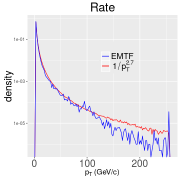
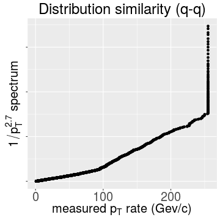
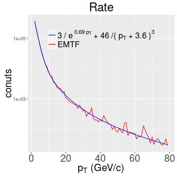
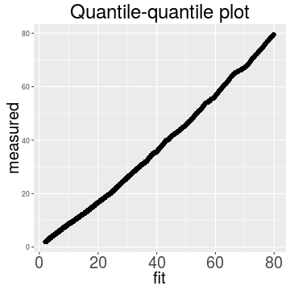
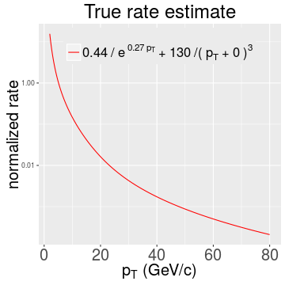
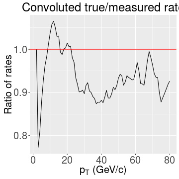

## Outline (continue of [previous talk](https://kkotov.github.io/emtfPtRegression/2017.02.10/))

Measured rate spectrum
* fitting with a power spectrum
* different components in the spectrum

Low $p_T$ rate spectrum component
* closer look
* better parametrization

Deconvolution of the "true" underlying rate from the spectrum
* constructing the likelihood
* closure tests

Summary

--- &twocol

## Properties of the measured rate

*** =left

*** =right

*** =fullwidth

Clearly seen are two components meeting at $\sim$100 GeV/$c$ (and the EMTF pT saturation)

Since all of the thresholds of interest are < 100 GeV/$c$ let's zoom in to the first component

--- &twocol

## Low $p_T$ part of the measured rate 

*** =left

Simple power law is a crude approximation, exponent + power law works better:

*** =right

But quantile-quantile plot is not straight $\rightarrow$ the fit is still rather mediocre, of course:

*** =fullwidth

I'll stick with this parametrization keeping in mind the excluded [1-2] GeV/$c$ bin

--- .class #id

## Deconvolution of underlying rate spectrum

Likelihood $L(R|r,e) \sim -\prod_i Poiss(r_i | e_i ^j R_j)$ where, as [before](https://kkotov.github.io/emtfPtRegression/2017.02.10/#8),
$r_i$ - measured rate above threshold $i$;
$R_j$ - true rate in bin $j$ of true $p_T$;
$e_i ^j$ - efficiency in $i^{th}$ bin of true $p_T$ for threshold $j$

Closure tests with $R$ modeled as $A/e^{\alpha p_T ^{thr}}$ or $B/(p_T ^{thr}-b)^\beta$ and $e_i ^j \sim erf(\gamma(p_{T,j} ^{true}-p_{T,i} ^{thr}))$:

Parameter                   | $A^{set}/A^{fit}$  | $\alpha^{set}/\alpha^{fit}$ | $B^{set}/B^{fit}$ | $\beta^{set}/\beta^{fit}$ | $b^{set}/b^{fit}$
----------------------------|--------------------|-----------------------------|-------------------|---------------------------|-------------------
$\gamma$=100, 1K bins       | 1/0.95 | 2/2 | 0/-0.047 | 0/3 | 0/1.1 &times; 10-4
                            | 0/-0.047 | 0/1 | 1/0.95 | 3/3 | 0/0.0051
$\gamma$=100, 78 bins      | 1/0.83 | 2/0.93 | 0/-0.17 | 0/3 | 0/-0.0026
                            | 0/-0.18 | 0/1 | 1/0.81 | 3/3 | 0/0.038
$\gamma$=0.1, 78 bins      | 1/1.1 | 2/1 | 0/0.061 | 0/3 | 0/3 &times; 10-4
                            | 0/0.034 | 0/1 | 1/1 | 3/3 | 0/-0.0059
real turn-on                | 1/0.34 | 2/1.9 | 0/0.46 | 0/3 | 0/0.055
                            | 0/0.45 | 0/1 | 1/0.42 | 3/3 | 0/-0.012

--- &twocol

## Realistic underlying spectrum

Using parametric form for $R$ and turn-ons $e$ from the [last talk](https://kkotov.github.io/emtfPtRegression/2017.02.10/#5) I assess $R$ from $r$:

*** =left

*** =right

*** =fullwidth

Test on the right shows ratio of estimated true rate convoluted with turn-on and measured rate

Nothing is ideal, of course, but agreement within $\sim$20% is not a bad thing here

--- .class #id

## Summary

* The underlying true rate spectrum consists of multiple components

* $p_T \sim$ [0-5] GeV/$c$ seems to be falling exponentially, but being suppressed by
the turn-on cannot be reliably measured from data

* $p_T \sim$ [5-80] GeV/$c$ seems to be described well by $1/p_T^3$ spectrum

* $p_T >$ 80 GeV/$c$ falls even faster, but presents a little interest
