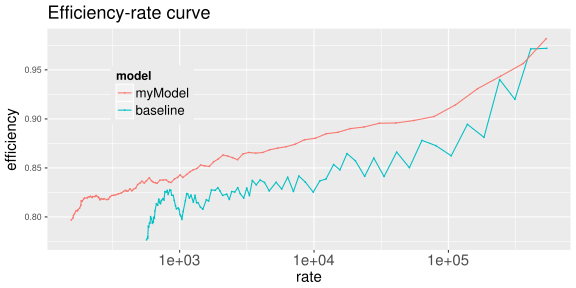
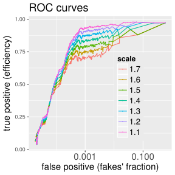
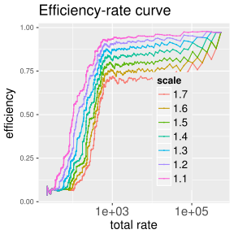
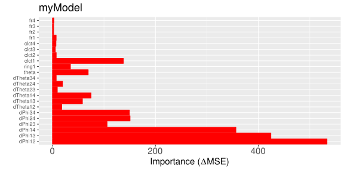
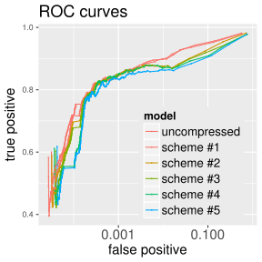
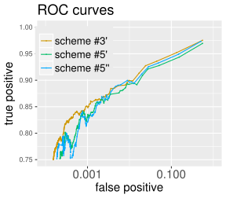
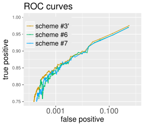
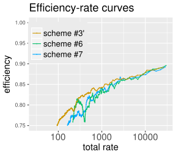
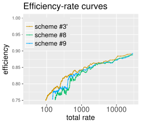

## Outline

Metrics
* ROC curves
* Efficiency-rate curves

Scaling baseline EMTF model for proper comparison

Input compression
* several test schemes
* overal performance
* sources of impact on efficiency 

Summary

--- &twocol

## Constructing ROC curves

[ROC curves](https://kkotov.github.io/emtfPtRegression/2017.02.10/#6) built with
[$1/p_T ^3$ spectrum](https://kkotov.github.io/emtfPtRegression/2017.03.03/#6)$^*$
and turn-ons for "myModel"$^{**}$ and EMTF ("baseline"):

*** =left

*** =right

*** =fullwidth

$^*$&nbsp;any&nbsp;shape do well for qualitative comparison of the two models (i.e. relative behavior)

$^{**}$ "myModel" is trained with $\Delta\phi \times 6$, $\Delta\theta \times 6$, $CLCT \times 4$, $FR \times 4$ (all full precision)

--- .class #id

## Constructing efficiency-rate metric

Like for ROCs, efficiency results from convolution of spectrum with turn-on above threshold

Fraction of fakes is replaced with absolute number of events with predicted pT &gt; threshold

Comparing baseline and "myModel" using Andrew's zero bias ntuples:

--- &twocol

## Scaling baseline turn-ons

Baseline model was originally scaled to have ~90% efficiency at any given threshold

<!--Rescaling causes a small horizontal and large vertical shifts ([consequence of falling rate](https://kkotov.github.io/emtfPtRegression/2017.02.10/#6)):-->

Comparing baseline to itself for different scales shows apples-to-oranges problem:

*** =left

*** =right

*** =fullwidth

Baseline put on "myModel" scale (turn-ons cross at 50%) by multiplying thresholds with $1.43$

--- .class #id

## Relative importance of the inputs

The most important predictors are $\Delta\phi$ followed by $clct1$ (!), $\Delta\theta$, and $\theta + ring$

Compression (stipping most/least significant bits - MSB/LSB) should be guided by relative the importance of specific bits

--- .class #id

## Input compression

As proposed [earlier](https://kkotov.github.io/emtfPtRegression/2017.01.19/#12), I perform input transformations:
* "unsign" predictors; keep a bit for relative sign (e.g. ($S^\phi_{12,23}$) $\equiv$ sign($\Delta\phi_{23}*\Delta\phi_{12}$))
* "saturate" predictors at $N$ least significant bits (e.g. $|\Delta\theta_{12}|_{2 LSBs}\in\{0,1,2,3\}$)
* calculate dependent predictors "on the fly" (e.g. $\Delta\phi_{14} = \Delta\phi_{12} + \Delta\phi_{23} + \Delta\phi_{34}$) 

Following schemes (inspired by
[Andrew's talk](https://indico.cern.ch/event/623713/contributions/2516606/subcontributions/222725/attachments/1429297/2194604/2017_03_09_EMTF_LUT_bit_assignment.pdf))
for number of bits for predictors are used:
 
type | $\theta$ | $\Delta\phi_{12}$ | $\Delta\phi_{23}$ | $\Delta\phi_{34}$ | $S^\phi_{12,23}$ | $S^\phi_{12,34}$ | $\Delta\theta_{12}$ | $\Delta\theta_{23}$ | $\Delta\theta_{34}$ | $\Delta\theta_{13}$ | $\Delta\theta_{14}$ | $\Delta\theta_{24}$ | clct | fr
-----|----------|-------------------|-------------------|-------------------|------------------|------------------|---------------------|---------------------|---------------------|---------------------|---------------------|---------------------|---------------|-----------
#1   |  10      |      10           |        10         |         10        |         1        |        1         |         5           |         5            |         5          |         5           |       5             |           5         |  4,4,4,4 | 1,1,1,1 
#2   |  10      |     `7`           |       `5`         |        `5`        |         1        |        1         |         5           |         5            |         5          |         5           |       5             |           5         |  4,4,4,4 | 1,1,1,1 
#3   |  5       |      7            |        5          |         5         |         1        |        1         |         0           |         0            |        `0`         |         `0`         |         `3`         |          0          |  4,4,4,4 | 1,1,1,1 
#4   |  5       |      7            |        5          |         5         |         1        |        1         |         0           |         0            |         0          |          0          |          3          |          0          |  4,`0,0,0` | 1,`0,0,0` 
#5   |  5       |      7            |        5          |         5         |         1        |        1         |         0           |         0            |         0          |          0          |          3          |          0          |  `2`,0,0,0 | `0`,0,0,0 

(type #0 = "myModel" on previous slides, applies no compression; everything is mode=15 here)

--- &twocol

## Testing compression schemes

*** =left

*** =right

*** =fullwidth

Bottom-left part of the graphs corresponds to thresholds above ~50 GeV/$c$ $\rightarrow$ ignore $y < 0.8$

Efficiency drop (0.85 < $y$ < 0.95, scheme #1 $\rightarrow$ #2) appears at $\Delta\phi$ precision truncation

Schemes #2,3, and 4 show almost identical performance for thresholds <50&nbsp;GeV/$c$ (top-right)

--- &twocol

## MSB vs LSB in $\Delta\phi$ compression

type | $\theta$ | $\Delta\phi_{12}$ | $\Delta\phi_{23}$ | $\Delta\phi_{34}$ | $S^\phi_{12,23}$ | $S^\phi_{12,34}$ | $\Delta\theta_{14}$ | clct | fr
-----|----------|-------------------|-------------------|-------------------|------------------|------------------|---------------------|------|-----
#3'  |  7       |     `10`          |       10          |        10         |         1        |        1         |       [3:0]         | 4,4,4,4 | 1,1,1,1 
#5'  |  [7:2]   |  `[10:3]`         |   `[5:0]`         |      `[5:0]`      |         1        |        1         |       [2:0]         | 2,0,0,0 | 1,0,0,0 
#5'' |  [7:2]   |  `[10:3]`         |   `[8:3]`         |      `[8:3]`      |         1        |        1         |       [2:0]         | 2,0,0,0 | 1,0,0,0

*** =left

*** =right

*** =fullwidth

Chopping off LSBs of $\Delta\phi$ affects high-pT muons (bottom-left) and MSBs - low-pT (top-right)

--- &twocol

## MSB vs LSB in $\Delta\phi$ compression (2)

type| $\theta$ | $\Delta\phi_{12}$ | $\Delta\phi_{23}$ | $\Delta\phi_{34}$ | $S^\phi_{12,23}$ | $S^\phi_{12,34}$ | $\Delta\theta_{14}$ | clct | fr
----|----------|-------------------|-------------------|-------------------|------------------|------------------|---------------------|------|-----
#3' |  7       |      10           |       10          |        10         |         1        |        1         |       [3:0]         | 4,4,4,4 | 1,1,1,1
#6  |  [7:2]   |   `[9:2]`         |     `[8:3]`       |      `[8:3]`      |         1        |        1         |       [2:0]         | 2,0,0,0 | 1,0,0,0
#7  |  [7:2]   |   `[9:2]`         |     `[7:2]`       |      `[7:2]`      |         1        |        1         |       [2:0]         | 2,0,0,0 | 1,0,0,0

*** =left

*** =right

*** =fullwidth

Scheme #7 is marginally better than #6; both get close to 'no compression' scheme #3'

--- &twocol

## MSB vs LSB in $\Delta\phi$ compression (3)

type| $\theta$ | $\Delta\phi_{12}$ | $\Delta\phi_{23}$ | $\Delta\phi_{34}$ | $S^\phi_{12,23}$ | $S^\phi_{12,34}$ | $\Delta\theta_{14}$ | clct | fr
----|----------|-------------------|-------------------|-------------------|------------------|------------------|---------------------|------|-----
#3' |  7       |      10           |       10          |        10         |         1        |        1         |       [3:0]         | 4,4,4,4 | 1,1,1,1
#8  |  [7:3]   |   `[10:2]`        |     `[7:2]`       |      `[7:2]`      |         1        |        1         |       [2:0]         | 2,0,0,0 | 1,0,0,0
#9  |  [7:3]   |   `[9:1]`         |     `[7:2]`       |      `[7:2]`      |         1        |        1         |       [2:0]         | 2,0,0,0 | 1,0,0,0

*** =left

*** =right

*** =fullwidth

Trade-off: getting better at higer pT (bottom-left) means loosing at low pT (top-right)

--- .class #id

## Summary

The best compression scheme appears to be scheme #7, consistent with 
[Andrew's proposal](https://indico.cern.ch/event/623713/contributions/2516606/subcontributions/222725/attachments/1429297/2194604/2017_03_09_EMTF_LUT_bit_assignment.pdf)):

type| $\theta$ | $\Delta\phi_{12}$ | $\Delta\phi_{23}$ | $\Delta\phi_{34}$ | $S^\phi_{12,23}$ | $S^\phi_{12,34}$ | $\Delta\theta_{14}$ | clct | fr
----|----------|-------------------|-------------------|-------------------|------------------|------------------|---------------------|------|-----
#7  |  [7:2]   |     [9:2]         |      [7:2]        |       [7:2]       |         1        |        1         |       [2:0]         | 2,0,0,0 | 1,0,0,0

 

* all other $\Delta\theta$ are dropped
* predictors are unsigned and saturated (i.e. stuck to the largest allowed value if needed)
* $ring1$ and $\theta$ are combined according to Andrew's proposal

I didn't show most of the performance plots, but I can assure you that $fr1$ is important to keep

Now I'll move on modes other then #15 and include RPCs
